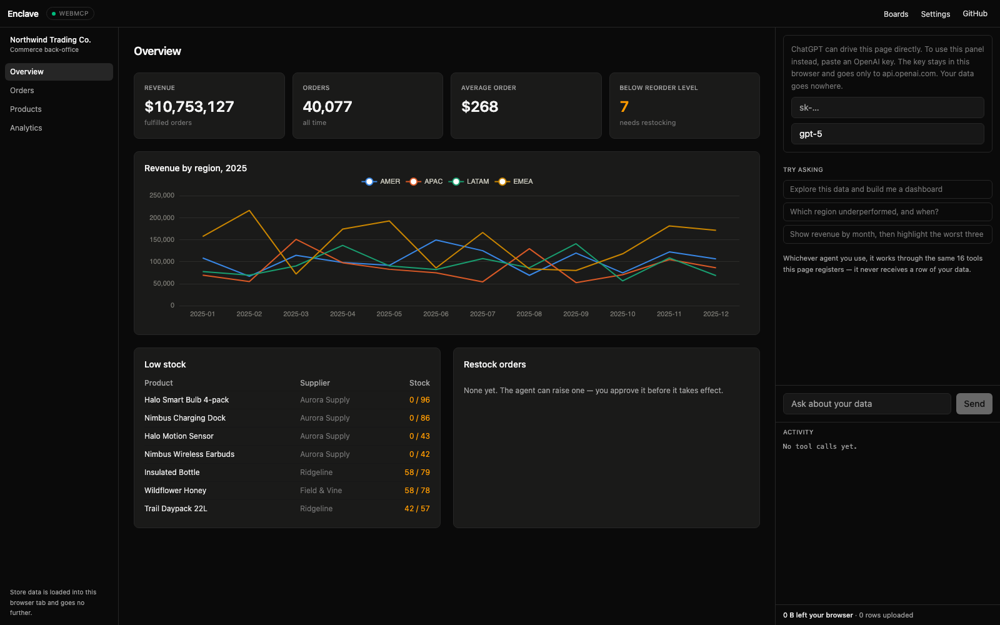
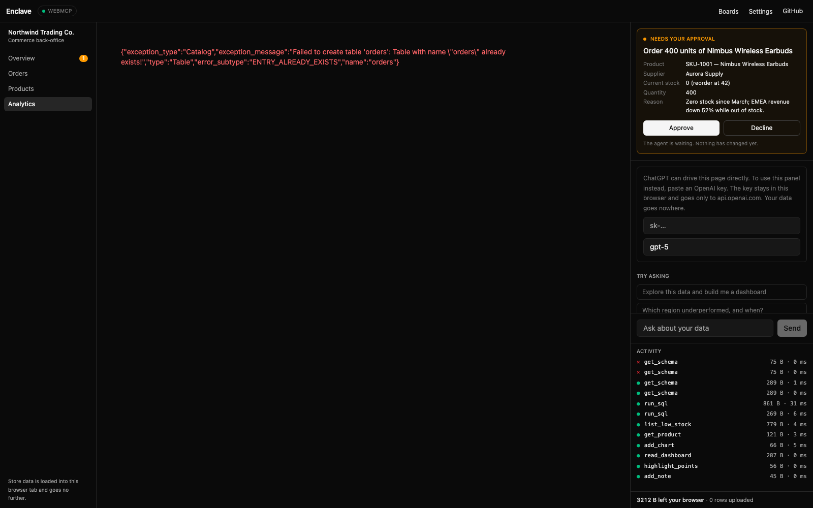

# Enclave

**A back-office your AI agent can actually operate.**

🔗 **[enclave-bay.vercel.app](https://enclave-bay.vercel.app)** · Built for [The WebMCP Challenge](https://webmcp.devpost.com/)



---

## What it is

Enclave is a commerce back-office for Northwind Trading Co., a fictional store.
Its orders and catalogue load into the browser tab and stop there. An AI agent —
ChatGPT over WebMCP, or the built-in panel — works the business through **22
registered tools**: it investigates, and when it wants to change something, it
proposes and waits for you.

It never receives a row of the data it is reasoning about.

## The problem

Two things stop an agent being useful in a real business.

**It cannot see your data.** Revenue, customers, orders — none of it can be
pasted into a chat window, so the analysis never happens.

**And it should not be clicking around your admin panel.** An agent guessing its
way through a UI is slow, brittle, and occasionally catastrophic.

WebMCP answers both: the page states exactly what an agent may do, the data stays
where it is, and anything consequential waits for a human.

## The arc the demo store carries

The data has one real problem in it, and the whole route to the fix is
discoverable without the agent ever seeing a row.

1. **It notices.** Revenue by region, month by month — EMEA falls 52% in March
   2025 and no other region moves.
2. **It finds the cause.** Broken down by supplier, one name is missing from
   March entirely: Aurora Supply sold nothing in EMEA that month.
3. **It checks the shelf.** All four Aurora products are still at zero stock,
   below their reorder level. The revenue hole and the empty shelf are the same
   fact.
4. **You decide.** It proposes a restock order with its reasoning and stops.
   Nothing changes until you approve it on screen.



## Nothing changes without you

Reading is free. Anything that touches the business — a restock order, a price —
is *proposed*: the tool call blocks, an approval card appears carrying the
agent's reasoning, and the change is applied only on approval. Decline, or take
too long, and the tool reports back that nothing happened.

That pause is the product. It is where the human and the agent actually meet.

## The tools

**Explore the data** — `get_schema` · `profile_column` · `sample_rows` · `run_sql`

**Build the analysis** — `add_kpi` · `add_chart` · `add_table` · `add_note` ·
`update_card` · `remove_card` · `reorder_cards` · `resize_card` ·
`highlight_points`

**Read it back and steer** — `read_dashboard` · `set_global_filter` · `undo`

**Run the store** — `search_orders` · `get_product` · `list_low_stock` ·
`list_restock_orders` · `create_restock_order`\* · `set_product_price`\*

\* requires operator approval.

The surface is deliberately **bidirectional**: the agent can read the current
state of the data, the analysis board and the catalogue, not only write to them.
`read_dashboard` is what lets it revise an analysis it did not build itself.

## How it is built

```
             ┌─────────────── Enclave (browser tab) ───────────────┐
             │                                                     │
  ChatGPT ───┼──→ document.modelContext ──┐                        │
             │                            ├──→ TOOL REGISTRY       │
  Built-in ──┼──→ OpenAI Responses API ───┘    (22 tools, one      │
  panel      │    (your own key)                definition site)   │
             │                                       │             │
             │                        ┌──────────────┴───────────┐ │
             │                        ▼                          ▼ │
             │                 approval gate            DuckDB-WASM │
             │                 (writes only)            store data  │
             └─────────────────────────────────────────────────────┘
                    no server · data never leaves the tab
```

**One registry, two runtimes.** Tools are defined once in `src/tools/`. One
adapter registers them with `document.modelContext`; another exposes the same
list to the OpenAI Responses API. Identical capabilities, identical approval
gates, either way.

**The global filter is a view swap.** Analytics cards read from the view `data`
— orders joined to their products. `set_global_filter` runs one statement,
`CREATE OR REPLACE VIEW data AS SELECT * FROM (<base>) WHERE …`, and every card
on the board re-renders against the filtered data.

**Every result is budgeted.** Tool output passes through a single cap of 50 rows
and 4 KB before it can reach an agent — adjustable in settings, so the person
holding the data sets the dial. Raw row dumps are refused with a message
steering the agent toward aggregation.

**Saved boards store the analysis, never the data.** Cards and the filter, so a
board re-runs against whichever dataset is loaded.

## Running it

```bash
npm install
npm run dev      # http://localhost:5173
npm test         # 133 tests
npm run build
```

Useful dev scripts:

```bash
node scripts/generate-samples.mjs        # regenerate the store's synthetic data
node scripts/e2e-agent.mjs               # drive the whole arc as an agent would
node scripts/verify-native-webmcp.mjs    # prove the native API sees the tools
```

### With native WebMCP

WebMCP is available in Chrome 149+ behind an origin trial, or locally via
`chrome://flags/#enable-webmcp-testing`. Verified here against Chromium 151
launched with `--enable-features=WebMCP`:

```bash
node scripts/verify-native-webmcp.mjs https://enclave-bay.vercel.app
```

That script is the receipt: it discovers all 22 tools through the native
`document.modelContext.getTools()` on the deployed URL and executes them. Two
things worth knowing if you build against the native API: `executeTool` takes
its arguments as a **JSON string**, not an object, and `inputSchema` comes back
as a string too.

The page sets `Origin-Agent-Cluster: ?1` (see `vercel.json`), which WebMCP
requires. It deliberately does **not** set COOP/COEP: that would make DuckDB's
`selectBundle()` choose the threaded `coi` bundle and demand cross-origin
isolation. Without those headers it picks `eh`, which needs neither.

### Without WebMCP

Paste an OpenAI key into the panel on the right. It is stored in your browser
and sent only to `api.openai.com`. Your data still goes nowhere.

## The data

`public/samples/` holds Northwind's synthetic orders and catalogue, generated
deterministically by `scripts/generate-samples.mjs` — the script documents
exactly how the March stockout is seeded. Analytics also takes any CSV you drop
on it.

## Stack

Vite · React · TypeScript · Tailwind · Zustand · DuckDB-WASM · ECharts ·
Vitest. No backend.

Chart colours come from a validated categorical palette (worst adjacent
colour-vision-deficiency ΔE 9.1 light / 8.4 dark). `highlight_points` uses
focus-and-context — highlighted marks keep their series colour and the rest
recede — rather than repainting marks to a signal colour.

## Licence

MIT — see [LICENSE](LICENSE).
